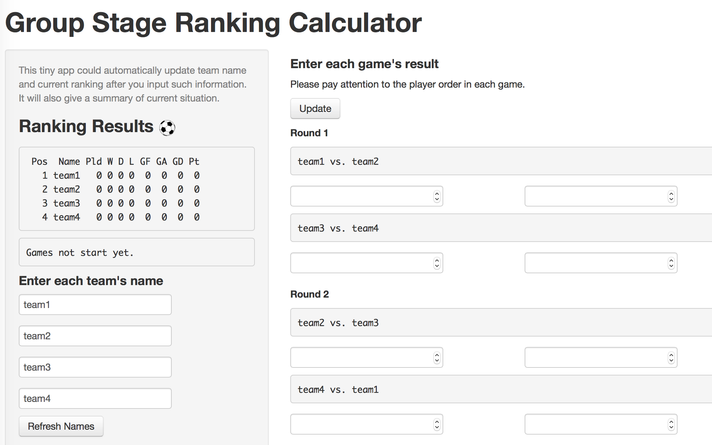

## Purpose 


You are the editor of a sport website. You were struggling in calculating teams' rank in Group Stage during 2014 World Cup. 


You could hire [this calculator](http://linzifan.shinyapps.io/score) to do so and update team name and current ranking automatically!


 &nbsp;   


--- .class #id 

## Interface
 


* Step 1: Enter each team's name. The names will automatically be refreshed on both ranking result and game details.
* Step 2: Enter the game result as long as you know and update. The ranking result will be updated and the summary will tell how many rounds left and who take the lead or who has advanced to knockout stage.


--- .class #id 

## R code
The key function of this app is self-made function `soccer.rank`. Here are some highlights of this function.

```r
soccer.rank <- function(names,G1,G2){
 match$A <- matrix(as.numeric(c(matches[1,2:3],matches[4,3:2],matches[5,2:3])),3,2,byrow=T)
 team$A <- c(W=0,D=0,L=0,GF=0,GA=0) ...  
  for (j in 2:5){
    for (i in 1:3)
    {if (!is.na(match[[j]][i,1]))  
      {team[[j]][1] <- team[[j]][1] + (match[[j]][i,1]>match[[j]][i,2]) ...}}}
  result[result$Team=="A",5:9] <- team$A ...
  result$Pld <- result$W+result$D+result$L ...
  # Tiebreaking criteria
  # 1.Greater number of points obtained in the group matches between the teams concerned
  # 2.Goal difference resulting from the group matches between the teams concerned
  # 3.Greater number of goals scored in the group matches between the teams concerned
  result <- result[order(-result$Pt, -result$GD, -result$GF),] ...
  return(result)
}
```

--- .class #id 

## Further Development
* Optimize the layout. We can use some plot tools to show the output of ranking result, so the font and color can be applied.
* Show the multiple group result and knockout stage. Once we get the team names and game results, the [whole road map](http://en.wikipedia.org/wiki/2014_FIFA_World_Cup_group_stage) of World Cup could be drawn, just like what Wikipedia shows.

